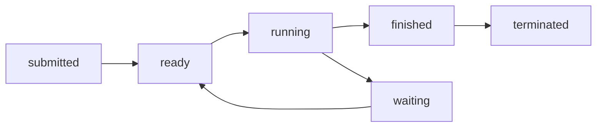

# My Answer

## Q1


>Extra Note:
>
>HRRN: Highest Response Ratio Next
>
>​	Priority $P=\frac{t_{wait}+t_{served}}{t_{served}}$
>
>​	Pseudo-code:
>
>​	When a new job arrives or timer interrupts:
>
>​	do
>
>​		check if there are jobs in queue
>
>​			yes then 
>
>​				calculate priorities of jobs
>
>​				pick the one of highest priority
>
>​			no then
>
>​				pick the newly-arrived job or do nothing
>
>​	done

|         Time         | HRRN | FIFO/FCFS |  RR  | SJF  | Priority |
| :------------------: | :--: | :-------: | :--: | :--: | :------: |
|          1           |  A   |     A     |  A   |  A   |    A     |
|          2           |  A   |     A     |  A   |  A   |    B     |
|          3           |  A   |     A     |  B   |  A   |    A     |
|          4           |  A   |     A     |  A   |  A   |    C     |
|          5           |  B   |     B     |  C   |  B   |    C     |
|          6           |  C   |     C     |  A   |  C   |    D     |
|          7           |  C   |     C     |  D   |  C   |    D     |
|          8           |  D   |     D     |  C   |  D   |    D     |
|          9           |  D   |     D     |  D   |  D   |    A     |
|          10          |  D   |     D     |  D   |  D   |    A     |
| Avg Turn-around Time | 4.5  |    4.5    | 4.75 | 4.5  |   4.25   |


## Q2


### a. Give a concise proof why x≤25 when both threads have completed. 

Because there are at most 5 twos and 5 threes to be added to x.

#### Std answer:


### b. Give a concise proof why x≠2 when both threads have completed

Because at least one thread will be executed and one loop will be gone through, so the added amount will at least be 2.

#### Std answer:

Same as Q2a.

### c. Suppose we replace ‘x = x+3’ in Thread B with an atomic double increment operation atomicIncr2(x) that cannot be preempted while being executed. What are all the possible final values of x? Explain. 

The value of x will at least be 10. Possible values can be 10, 12, 14, 16, 18, 20. 

Explanation:

///////////////

#### Std answer:

need to check

### d. What needs to be saved and restored on a context switch between two threads in the same process? What if the two threads are in different processes? Be explicit

Everything in a TCB including: ///////////

* Stack pointers
* Stack
* Program counter

Everything in a PCB including:///////

* TCBs
* Heap
* Open File Descriptors


#### Std answer

need to check

### e. Under what circumstances can a multithreaded program complete more quickly than a non-multithreaded program? Keep in mind that multithreading has context-switch overhead associated with it

* There are operations that can be executed in parallel
* The are execution units that can run parallel without conflicts
* The speed-up can cover the overhead of context switch

#### Std answer:

same

## Q3

### a.


| std out       | test.txt                                                     |
| ------------- | ------------------------------------------------------------ |
| Starting main | CS 302 SUSTech, in child<br>Ending main: 0<br>CS302 SUSTech, in parent<br>Ending main: 123 |

#### Std answer:

same

### b.


| std out                                                    | test.txt                                     |
| ---------------------------------------------------------- | -------------------------------------------- |
| Starting main<br>CS302 SUSTech, in child<br>Ending main: 0 | CS302 SUSTech, in parent<br>Ending main: 123 |

#### Std answer

same

### c.


Answer:////////////////????????????下面的自己写的答案顺序反了

```c
void apple()
{
    pid_t oval = getpid();//answer line
    kill(oval, SIGTEST);
}
void orange(int i)
{
    val =1;
}
int val = 0;
int main()
{
    pid_t pid = fork();
	bind sigtest handler to orange();//answer line
    if(pid==0) //in child
    {
       apple();//answer line
    }else
    {
      waitpid(pid);//answer line
    }
    printf("val=%d\n",val)
}
```

#### Std answer:

need to check, my answer is false

```c
void apple()
{
    pid_t oval = getppid();//answer line, get parent pid
    kill(oval, SIGTEST);
}
void orange(int i)
{
    val =1;
}
int val = 0;
int main()
{
    pid_t pid = fork();
	bind sigtest handler to orange();//answer line
    if(pid==0) //in child
    {
       apple();//answer line
    }else
    {
      waitpid(pid);//answer line
    }
    printf("val=%d\n",val)
}
```


### d.

If a child process sends a `SIGKILL` signal to its parent, what happens to the parent process and the child process? Can the parent prevent this from happening?

///////////////don’t know

#### Std answer:

need to check

##### Extra

如果在terminal，然后建立父子进程，按ctrl+c会发生什么？

会杀死进程组的进程，都死了

### e.

Consider the following scenario. A process forks a child process and the parent process waits on it. Then, the child exits normally and the parent is unblocked. Finally, the parent makes another wait call on the child process. What happens to this last wait call and to the parent process?

The wait call exits immediately.

#### Std answer

need to check

### f.

Why do we switch from the user’s stack to a kernel stack when we enter the kernel (e.g. for a system call)? Why do we associate a unique kernel stack for each user thread? //////

Because kernel is crucial, and we want data in kernel keep separate from user-space data to prevent messing up the kernel.

Because each thread has its own local variables and we do not want to mix up this local variables, which is important for a thread. 

#### Std answer:

need to check

## Q4

### a. What is the difference between “Parallelism” and “Concurrent” in job scheduling

////// don’t know

#### Std answer:

need to check

### b.  Please draw the life cycle of process and thread, then compare the difference of process and thread



* A process may contain multiple threads. 
* Processes do not share memory while threads in one process share memory space.
* the control unit of a process is PCB while TCB is the control unit of a thread.

#### Std answer:

need to check

### c. Please describe the actions in operating system when “fork()” function executed.

The program will shift to system mode, and then the kernel will copy all contents of a process in PCB and memory and create a new child process with the same content. After copying, the child process and parent process both return from `fork()`, getting 0 and the child’s pid respectively.

#### Std answer:

need to check

### d. Please list the storage unit with its access latency in a modern commodity personal computer (as many as possible), and analyze the underlying trade-off strategy in current storage system.

//////don’t know

#### Std answer:

need to check

### e. Please give the clear definition of user time, system time and real time, then give two concrete examples to show 1) real time < user time + system time and 2) real time > user time + system time.

Real time: The time elapsed seen in the real clock in real world

User time: The CPU time that a user program takes.

Kernel time: ////////////

#### Std answer:

need to check

## Q5 Multiple Choices


1. In which condition(s), a new process will be created in Linux? 

   A. User login by remote ssh B. execute `ls` on a shell C. call exec*() in a program D. call pthread_create() in a program

2. Which of follows is(are) not shared by different thread in the same process? 

   A. PID B. File descriptor C. Execution Stack D. PC 

3. Which threading model(s) is(are) not exist? 

   A. One to many B. Many to many C. Many to one D. One to one 

4. Which system calls are employed to implement a C libary call “system()”? 

   A. fork() B. exec*() C. wait() D. pipe() 

5.  () is the interface that Operating System provides to application. 

   A. system call B. interrupt C. library function D. atomic operation 

6. Which is the proper time to reduce the priority of process? 

   A. the time slice of the process is used up. B. the process just finished I/O and enter into ready queue. C. the process stays in ready queue for a long time. D. the state of the process changes from ready to running. 

7. In following options, () is the scheduling algorithm that satisfies Shortest Job First(SJF) and will not cause starvation. 

   A. First Come First Serve(FCFS) B. Highest Response Ratio Next(HRRN) C. Round-robin D. Non-preemptive SJF 

8. Which is executed during user space? 

   A. command line interpreter (shell) B. page fault handler C. process scheduler D. clock interrupt handler 

9. Which does not happen in user space? 

   A. system call B. external interrupt C. context switch D. page fault 

10. Both interrupt handling and subroutine calling need protection by stack pushing. Which is the content that interrupt handling has to save but subroutine calling not? 

    A. PC B. flag register C. data register D. address register

11. If a user process read data from certain disk file by read() system call, then which of the following statement(s) is correct? 

    1. If the data of file does not exist in main memory, then this process will change to waiting state 
    2. Invoking read() system call will lead CPU change from user space to kernel space
    3. The argument of read() should include file name

    A. Ⅰ and Ⅱ B. Ⅱ C. Ⅲ D. Ⅰ, Ⅱ and Ⅲ

12. In a multiprogramming system, only two jobs P1 and P2 exist. The arrival time of P2 is 5ms later than that of P1, and their orders of CPU computation and I/O operation are shown as follows: 

    1. P1: Computation 60ms, I/O 80m, Computation 20ms 

    2. P2: Computation 120ms, I/O40ms, Computation 40ms If not considering scheduling and switch time，then the least time to finish both jobs is () 

       A. 240ms B. 260ms C. 340ms D. 360ms

13. //mistaken to skipped

14. In a single-processor multi-process system, if there are several ready processes, then the wrong statement about process scheduling is (). 

    A. process scheduling can execute when a process terminates 

    B. process scheduling can execute when a process creates 

    C. process scheduling can execute when a process is in critical section 

    D. process scheduling can execute when system call finished and system returns to user space

15. For the statements about thread and process, which one is correct? 

    A. No matter the system supports threads or not, process is the basic unit of resource allocation. 

    B. Thread is the basic unit of resource allocation and process is the basic unit of scheduling. 

    C. the switches of user-level and kernel-level threads all need the support of kernel. 

    D. every thread in the same process has distinct address space. 

16. Which will lead a user process switch from user space to kernel space? 

    I. division by zero 

    II. sin() function call 

    III. read() system call 

    A. I and II B. I and III C. II and III D. I, II and III

17. After computer boosting, Operating System will be finally loaded to () A. BIOS B. ROM C. Disk D. RAM

18. A system is running three processes P1, P2 and P3, the time ratios of CPU computation and I/O are shown as follows

    

    To improve the efficiency of resource usage, which priority setting for processes is more reasonable? A. P1 >P2 >P3 

    B. P3>P2 >P1 

    C. P2>P1 =P3 

    D. P1>P2=P3

19. Suppose the following instructions have been loaded to instruction registers, which instruction cannot lead CPU to switch from user space to kernel space?

    A．DIV R0，R1; // (R0)/(R1) → R0 

    B．INT n；// generate soft interrput 

    C．NOT R0；// do NOT operation for contents in R0 

    D．MOV R0,addr；// move the data in addr from main memory to R0 

20. Which will lead the state of a process to change from running to ready? 

    A．execute wait() 

    B．fail to malloc() 

    C．start I/O device 

    D．preempt by high priority process


### Need to check Std answers


