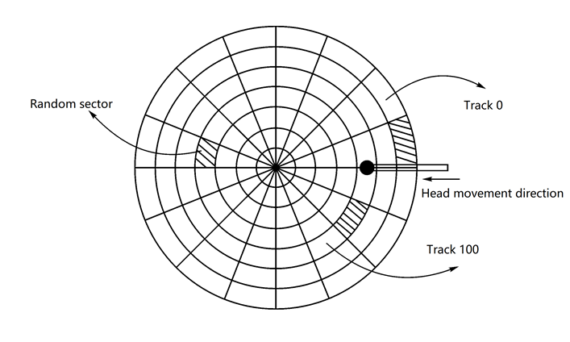

# Report 8

## Q1.

1. I/O control methods can be classified as (1)_________(2)__________.
2. Each physical record on the disk has a unique address that consists of three parts: (1)______________(2)_______________(3)________________.
3. Data READ/WRITE time = (1)_____________ + (2) ____________ +(3)____________.
4. The metric for measuring I/O performance are (1)__________,(2)___________.

### Answers:

1. Can be classified as
   * Programmed IO
   * DMA
2. Three parts:
   * Head Identifier
   * Track Identifier
   * Sector Identifier
3. Data READ/WRITE time =Seek Time + Rotational Delay+ Transfer Time
4. Metrics:
   * Bandwidth
   * Response Time

## Q2. What are the work steps of the DMA controller? Please answer it and briefly describe the process of each step

1. the DMA controller get the information about what data to be transferred into the memory and its location on disk and destination in the memory from its device driver.
2. the device controller initiates DMA transfer
3. the device controller sends bytes to the DMA controller
4. the DMA controller transfers bytes to the destination in memory
5. when finishing transfer, the DMA controller interrupts CPU to signal the transfer completion.

## Q3. Under what circumstance, the SSTF algorithm will cause starvation?

There is a request of which accessing data is located on a far-away track with respect to the location of the head, and other incoming requests are accessing neighborhoods of the current track that the head is accessing, then this far-away request gets starved because the priority of it is always the lowest in SSTF algorithm.

## Q4.

Suppose the computer system uses the disk as the following:

Let a single-sided disk rotation speed be 12000r/min, each track has 100 sectors, 200 tracks in total, and the average movement time between adjacent tracks is 1 ms.

If at some point, the head is located at track 100 and moves in the direction in which the track number increases, the track number request queue is 70, 90, 30, 120, 20, 60. For each track in the request queue, a randomly distributed sector is read.

a) If the C-SCAN algorithm is used to read the six sectors,

​    (1) Write the track access sequence (5 points)

​    (2) How much time is required in total? The calculation process is required. (15 points).

b) If using SSD, which scheduling algorithm do you think should be used, and explain   why? (10 points)

### Answers:

a. 

​	(1). Track access sequence

​	(100), 120, 199, 0, 20, 30, 60, 70, 90

​	(2). 

​	Ignoring the queuing time and transfer time.

​	Total Seek Time = ((199-0)+(199-100)+(90-0))*1ms = 388ms

​	Assuming sector access with an uniform distribution:

​		Time per Rotation = (60s/min)*(1000ms/s) / 12000r/min = 5ms/r

​		Avg Sector Access Time = 5/2 = 2.5ms

​		So to read six sectors, the time needed is 6*2.5ms=15ms

​	So the total time needed = 15ms + 388ms = 403ms

b. 

​	I think LOOK should be used because sectors/blocks with close numbers should be (but not always) stored physically close to each other, and compared to FIFO, C-LOOK, SCAN and C-SCAN, LOOK can better utilize this spatial locality to improve performance, prevent starvations and reduce unnecessary overhead.